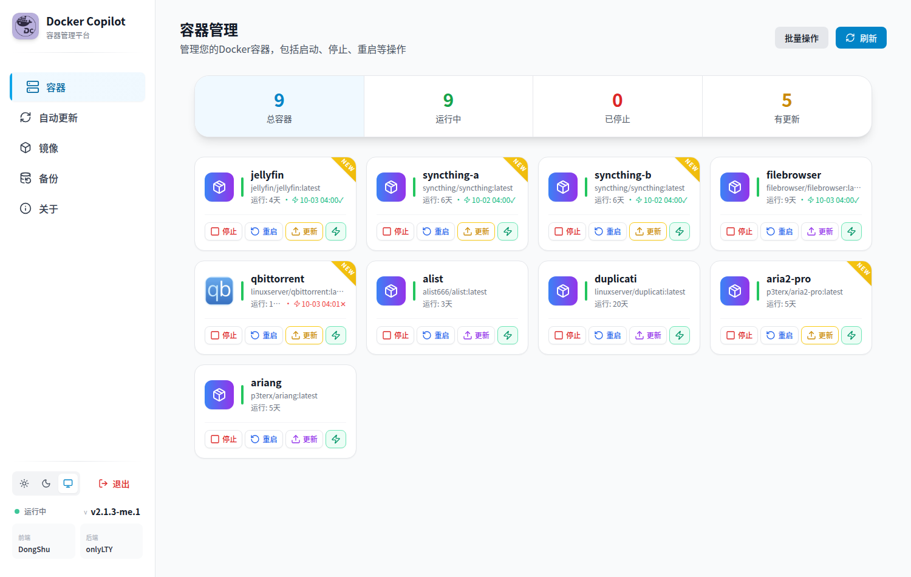
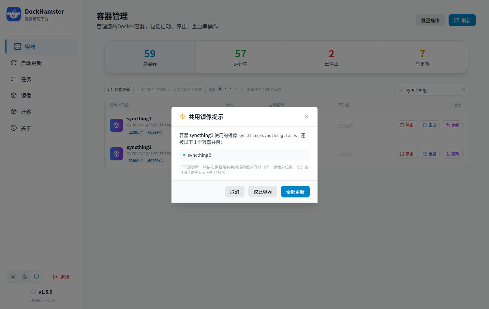
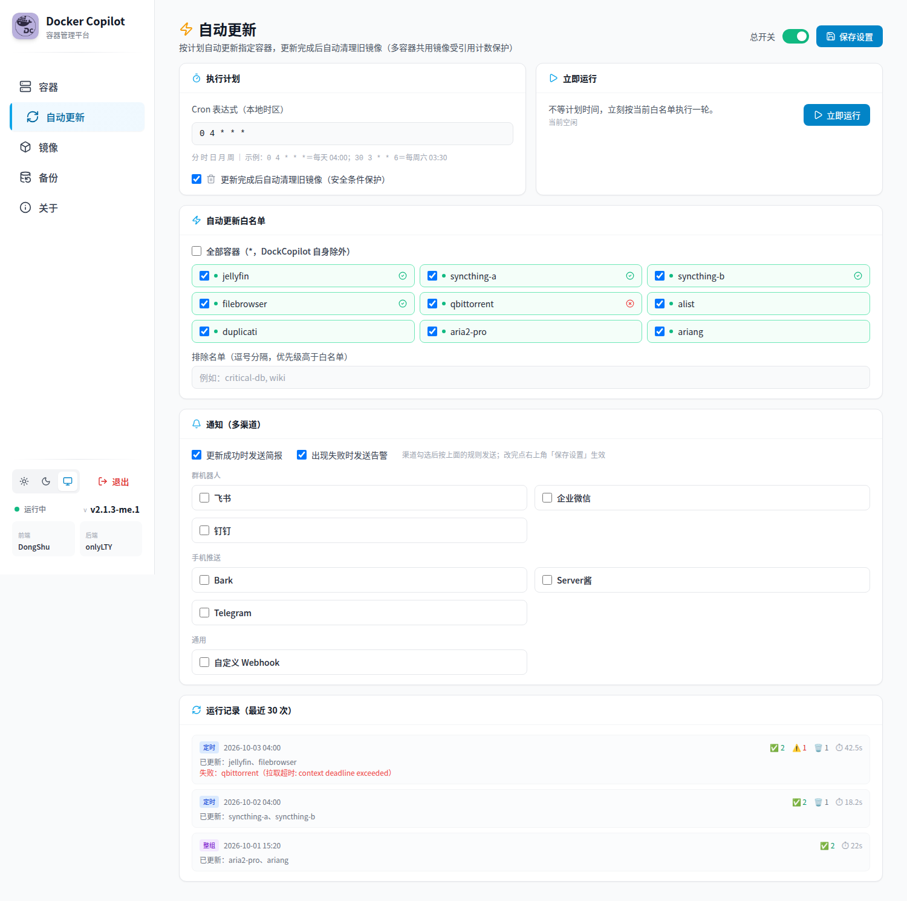

# DockerCopilot · 非官方增强版（DockerCopilotMe）

> ⚠️ 本项目是基于 [onlyLTY/dockerCopilot](https://github.com/onlyLTY/dockerCopilot)（AGPL-3.0）的**非官方社区增强分支**。
> 在官方基础上新增了「自动更新白名单（UI 配置）、旧镜像安全清理、多容器共用镜像整组更新、飞书通知」等实用功能。
>
> 🐳 镜像：`libremk66/dockercopilotme` ｜ 📦 源码：本仓库（`custom` 分支）｜ 📖 功能详解：[CUSTOM.md](./CUSTOM.md)

## 目录

- [一、相对官方新增了什么](#一相对官方新增了什么)
- [二、界面预览](#二界面预览)
- [三、快速开始](#三快速开始)
- [四、自动更新怎么用](#四自动更新怎么用)
- [五、跟随官方更新](#五跟随官方更新)
- [六、许可与致谢](#六许可与致谢)

## 一、相对官方新增了什么

| 功能 | 说明 |
|---|---|
| ⚡ **自动更新（UI 配置）** | 白名单容器按 cron 计划自动更新；容器卡片上一个开关即可加入/移出白名单；带运行记录与每容器最近结果 |
| 🗑️ **旧镜像自动清理** | 更新完成后自动清理悬空旧镜像；**多容器共用镜像受"引用计数"保护**（还有任何容器在用就绝不删） |
| 👥 **共用镜像整组更新** | 官方 issue [#144](https://github.com/onlyLTY/dockerCopilot/issues/144)/[#164](https://github.com/onlyLTY/dockerCopilot/issues/164) 场景：同一镜像被多个容器共用时，一键依次更新全部（**同一镜像只拉取一次**） |
| 🔔 **多渠道通知** | 更新成功/失败发送简报（含失败原因、清理统计、耗时）；支持**飞书 / 企业微信 / 钉钉 / Bark / Server酱 / Telegram / 自定义 Webhook**，每渠道独立测试 |
| 🩹 **上游修复** | ① 修复多 RepoDigests 时"永远提示有更新"（[#165](https://github.com/onlyLTY/dockerCopilot/issues/165) 同源问题）② 检查缓存并发安全（消除并发读写 map 隐患）③ 更新时保持容器原有运行状态（不再顺手启动已停止的容器） |

> 所有新增功能都可以不用：不配置白名单 = 与官方行为一致（纯手动模式）。

## 二、界面预览

**容器页**（每张卡片右下角绿色的 ⚡ 就是自动更新开关，状态行显示上次自动更新结果）：



**共用镜像整组更新**（点「更新」时自动识别共用同一镜像的其他容器）：



**自动更新页**（计划 / 白名单 / 通知 / 运行记录）：



## 三、快速开始

```yaml
# docker-compose.yml
services:
  dockercopilot:
    image: libremk66/dockercopilotme:latest
    container_name: dockercopilot
    restart: always
    environment:
      - TZ=Asia/Shanghai
      - secretKey=改成你自己的密钥   # 要求：大于8位且非纯数字
      # 可选：白名单初始值（仅首次生成配置时使用，之后以页面配置为准）
      # - AutoUpdateContainers=nginx,redis
    volumes:
      - /var/run/docker.sock:/var/run/docker.sock
      - ./data:/data
    ports:
      - "12712:12712"
```

```bash
docker compose up -d
# 浏览器打开 http://<你的主机>:12712 ，输入 secretKey 登录
```

## 四、自动更新怎么用

1. 打开侧栏 **「自动更新」** 页：勾选要自动更新的容器（或勾"全部容器"）、设定 cron 计划（默认每天 04:00）、按需填写飞书 Webhook
2. 或直接在**容器页**点某个卡片的 **⚡开关** 快捷加入白名单
3. 想验证效果：点「立即运行」，在「运行记录」里看结果
4. 建议：白名单先从**不怕重启的服务**开始（面板类/工具类），数据库等敏感容器用「排除名单」排除

⚠️ 自动更新会重建容器（等价于 `docker compose up -d` 的效果），请自行评估服务中断影响。

## 五、跟随官方更新

本分支基于官方 `latest` 持续跟随，机制为 rebase（我们的改动都是小颗粒、以新增文件为主）：

```bash
git fetch upstream latest && git rebase upstream/latest && git push origin custom
```

- 官方仓库：[onlyLTY/dockerCopilot](https://github.com/onlyLTY/dockerCopilot)；前端：[dongshull/Docker-Copilot-React](https://github.com/dongshull/Docker-Copilot-React)
- 通用修复已在向上游提 PR（欢迎去官方 issue 下 +1）
- 详见 [CUSTOM.md](./CUSTOM.md)

## 六、许可与致谢

- 本项目遵循 **AGPL-3.0**（与上游一致，见 [LICENSE](./LICENSE)）。
- **完整源码即本仓库**（`custom` 分支）：使用本镜像通过网络提供服务时，由此即可获取对应源码（AGPL §13）。
- 上游项目：[onlyLTY/dockerCopilot](https://github.com/onlyLTY/dockerCopilot)（后端）· [dongshull/Docker-Copilot-React](https://github.com/dongshull/Docker-Copilot-React)（前端），版权归原作者所有。
- 本分支为社区增强版，非官方发布；使用风险自负。
- 官方原始 README 备份见 [README.upstream.md](./README.upstream.md)。
