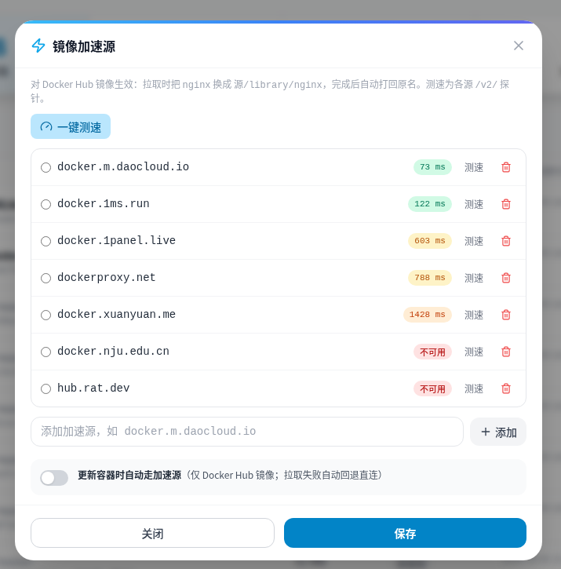
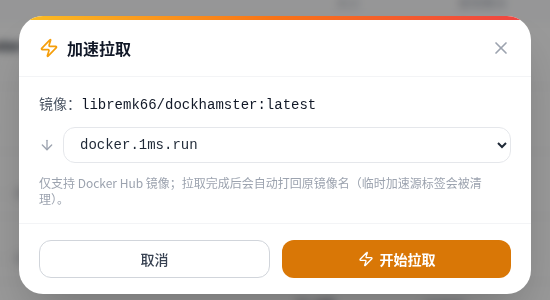
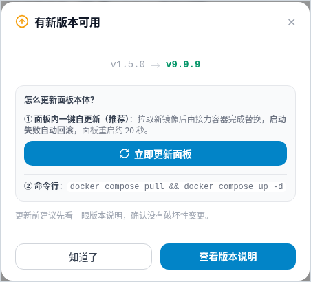
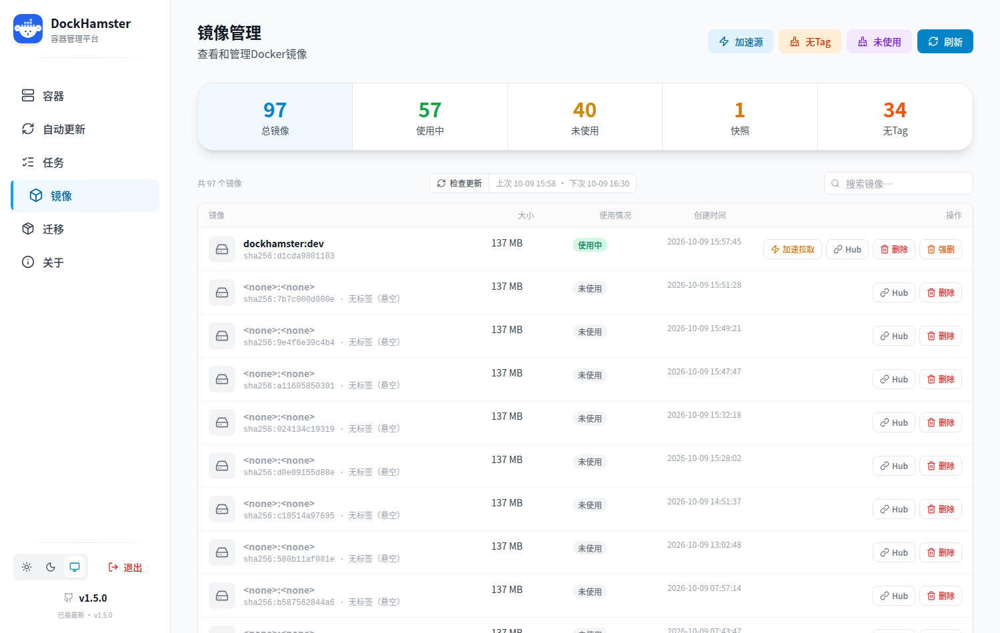
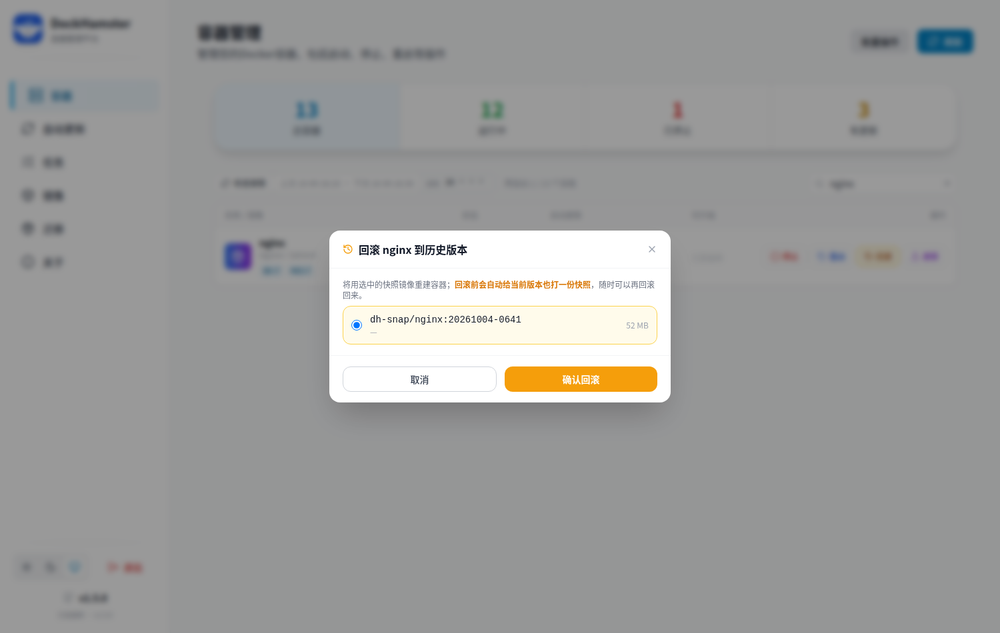
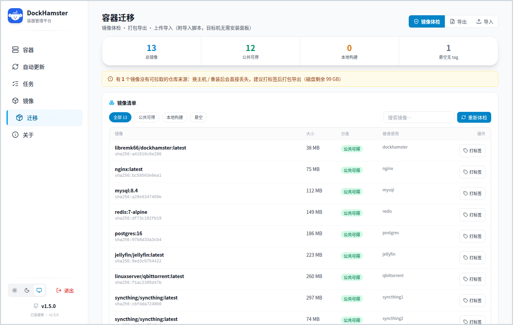
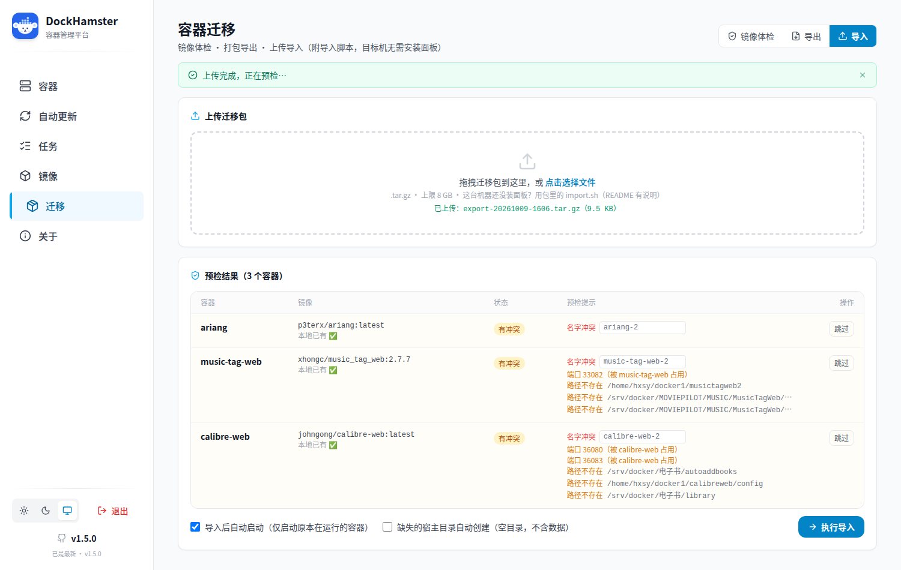

# 🐹 DockHamster · 容器仓鼠

<p align="center"></p>

[](https://hub.docker.com/r/libremk66/dockhamster)
[](https://hub.docker.com/r/libremk66/dockhamster)
[](LICENSE)

> **Docker 容器管理面板 · 增强版**
> 基于 [onlyLTY/dockerCopilot](https://github.com/onlyLTY/dockerCopilot)（AGPL-3.0）二次开发，专注"省心的容器运维"：自动更新、旧镜像清理、整组更新、多渠道通知、实时进度、列表化界面、镜像加速源、更新健康校验与自动回滚、面板自更新、容器异常守护、Web 端口直达。

## 目录

- [一、它是什么](#一它是什么)
- [二、相对原项目新增了什么](#二相对原项目新增了什么)
- [三、界面预览](#三界面预览)
- [四、快速开始](#四快速开始)
- [五、自动更新怎么用](#五自动更新怎么用)
- [六、上游与致谢](#六上游与致谢)
- [七、许可](#七许可)
- [📖 功能详解 · FEATURES.md](./FEATURES.md)

## 一、它是什么

一个自托管的 Docker 容器管理面板：启动 / 停止 / 重启、镜像管理与清理、容器迁移、容器更新检测，以及本版重点增强的**自动更新**能力。

- 纯 Docker 部署，单容器运行（内置前端，无需额外服务）
- 所有增强功能都可以不用：**不配置白名单 = 纯手动模式**，行为与原项目一致
- 配置持久化在 `/data/config/`，UI 保存即生效

## 二、相对原项目新增了什么

| 功能 | 说明 |
|---|---|
| ⚡ **自动更新（UI 配置）** | 白名单容器按 cron 计划自动更新；容器页列表一个开关即可加入/移出白名单；带运行记录与每容器最近结果。**更新检测**独立可配（默认每小时，走守护进程通道拿实时 digest），容器/镜像页有「检查更新」按钮随点随查 |
| 🗑️ **旧镜像自动清理** | 更新完成后自动清理悬空旧镜像；**多容器共用镜像受"引用计数"保护**（还有任何容器在用就绝不删） |
| 👥 **共用镜像整组更新** | 官方 issue [#144](https://github.com/onlyLTY/dockerCopilot/issues/144)/[#164](https://github.com/onlyLTY/dockerCopilot/issues/164) 场景：同一镜像被多个容器共用时，一键依次更新全部（**同一镜像只拉取一次**） |
| 🔔 **多渠道通知** | 更新成功/失败发送简报（含失败原因、清理统计、耗时）；支持**飞书（自建应用或群机器人）/ 企业微信 / 钉钉 / QQ 机器人 / Bark / Server酱 / Telegram / 自定义 Webhook**，每渠道独立测试 |
| 🗂️ **列表化界面 + 搜索** | 容器页 / 镜像页均为列表布局，状态、自动更新、可升级、操作一屏看清；容器按**名称/镜像**、镜像按**名称/Tag/ID** 实时搜索 |
| 📊 **实时进度** | 批量与单个更新全程可见：真实进度条 + **字节级拉取进度** + 心跳耗时；批量有「进行中」面板，单个更新在容器行内**整行展开进度子行** |
| 🏷️ **镜像快照与回滚** | 更新后的旧镜像可按策略处置：**自动清理**（默认）或**打快照保留**；容器页一键回滚到任意快照，**回滚前会自动给当前版本也打一份快照**（双向可回滚）；全局默认 + 每容器单独覆盖 |
| 📦 **容器迁移** | 三件套：**镜像体检**（找出换台机器就会丢的镜像）→ **打包导出**（docker save 镜像 + 容器配方 + compose + 一键导入脚本）→ **上传导入**（预检冲突，支持改名 / 端口重映射 / 卷路径映射）。迁移包自带 `import.sh`，**目标机没装面板也能还原** |
| 🩺 **更新健康校验 + 自动回滚** | 更新后观察新容器是否稳定（退出 / 反复重启 / OOM / 健康检查失败都算异常）→ 自动删掉新容器、把旧容器改回原名启动；**创建/启动失败也回滚**，更新失败不再把服务撂倒 |
| 🧭 **Web 端口直达 + 网站图标** | 容器行内直接列出对外端口，点一下新标签打开该容器的 Web 界面；图标自动匹配——内置常见镜像 logo，没有的自动抓取该容器网页 favicon（本地缓存 7 天） |
| ⚡ **镜像加速源 + 测速** | 内置常用加速源，支持增删与**一键并发测速**（按延迟排序）；「加速拉取」可把 Docker Hub 镜像走选定加速源拉取并自动打回原名；可开启「更新时自动走加速源」（失败自动回退直连） |
| 🔄 **面板自更新** | 面板更新自己不再"停到一半把自己停死"：用一次性**接力容器**完成替换，**启动失败自动回滚**；更新结果开机上报（日志 + 通知渠道） |
| 🐕 **容器异常守护** | 后台巡检：容器意外退出 / 被 OOM 杀掉 / 10 分钟内反复重启 → 推送告警；恢复运行也发一条。面板主动的停止/重启/更新不会误报（静默窗口），同容器同类告警 30 分钟冷却 |
| 🩹 **上游修复** | ① 修复多 RepoDigests 时"永远提示有更新"（[#165](https://github.com/onlyLTY/dockerCopilot/issues/165) 同源问题）② 检查缓存并发安全 ③ 更新时保持容器原有运行状态 |

## 三、界面预览

**容器页**（列表行内即为自动更新开关与上次结果；运行中容器的端口直接显示为可点按钮，图标自动匹配；更新中的容器在整行下方展开实时进度）：


**镜像加速源**（一键测速按延迟排序，「加速拉取」把 Docker Hub 镜像走选定源拉取后自动打回原名）：





**面板自更新**（侧栏提示有新版本时一键接力更新，失败自动回滚；也保留命令行方式）：



**镜像页**（总镜像 / 使用中 / 未使用 / 快照 / 无Tag 统计卡筛选，支持搜索）：



**共用镜像整组更新**（点「更新」时自动识别共用同一镜像的其他容器）：


**快照与回滚**（更新前自动留快照；容器行点「回滚」即可回到任意历史版本）：



**容器迁移**（镜像体检找出"换机即丢"的镜像 → 打包 → 导入预检）：





**自动更新页**（计划 / 白名单 / 通知 / 运行记录）：


## 四、快速开始

```yaml
# docker-compose.yml
services:
  dockhamster:
    image: libremk66/dockhamster:latest
    container_name: dockhamster
    restart: always
    environment:
      - TZ=Asia/Shanghai
      - secretKey=改成你自己的密钥   # 要求：大于8位且非纯数字
      # 可选：白名单初始值（仅首次生成配置时使用，之后以页面配置为准）
      # - AutoUpdateContainers=nginx,redis
    volumes:
      - /var/run/docker.sock:/var/run/docker.sock
      - ./data:/data
    ports:
      - "12712:12712"
```

```bash
docker compose up -d
# 浏览器打开 http://<你的主机>:12712 ，输入 secretKey 登录
```

## 五、compose 容器更新

由 docker compose 管理的容器（容器带 `com.docker.compose.*` labels）更新时自动走 compose 通道：`docker compose up -d --force-recreate --no-deps <service>`，只重建目标服务，不触碰同项目其他容器，compose labels 与配置保持一致不产生漂移。非 compose 容器仍走原有的 API 重建通道，无需任何配置。

**部署要求**：面板容器需能读到 compose 文件并具备 `docker compose` 命令：

1. 镜像已内置 compose plugin（自建镜像时确保安装 `docker-cli-compose`）
2. 在 volumes 中挂载 compose 文件所在目录（面板按容器 labels 里记录的**宿主机原始路径**查找文件，挂载点需与宿主路径一致）：
   ```yaml
   volumes:
     - <compose 项目所在目录>:<compose 项目所在目录>
   ```
3. compose 环境不可用时（未装 compose 命令 / compose 文件未挂载）更新会**自动回退 API 重建通道**，并在更新进度里明确提示——功能不会中断，但会有 compose 配置漂移风险，按提示补挂载即可恢复 compose 通道；compose 命令真正执行失败则按错误返回、不回退
4. 若同一数据卷在宿主上有多个挂载视角，可用环境变量 `COMPOSE_ALT_ROOTS`（逗号分隔前缀）配置兜底探测；未配置时不启用

## 六、自动更新怎么用

1. 打开侧栏 **「自动更新」** 页：勾选要自动更新的容器（或勾"全部容器"）、设定 cron 计划（默认每天 04:00）、按需配置通知渠道
2. 或直接在**容器页**列表里点某个容器的**自动更新开关**快捷加入白名单
3. 想验证效果：点「立即运行」，在「运行记录」里看结果
4. 建议：白名单先从**不怕重启的服务**开始（面板类/工具类），数据库等敏感容器用「排除名单」排除

💡 **共用同一镜像的多个容器**（例如两个 syncthing）建议**都勾上**：同一镜像只拉取一次，然后依次更新；旧镜像在最后一个使用者更新完成后才清理，未勾选的容器会一直提示「有新版本」。

⚠️ 自动更新会重建容器（等价于 `docker compose up -d` 的效果），请自行评估服务中断影响。

💡 通知卡片里还有一个默认开启的 **「容器异常告警」** 开关：容器意外退出 / 被 OOM / 反复重启会走同一套通知渠道推送（面板主动操作不误报）。

## 七、上游与致谢

DockHamster 的前身是原项目的一个增强分支，现已作为独立项目维护：

- 上游项目：[onlyLTY/dockerCopilot](https://github.com/onlyLTY/dockerCopilot)（后端）· [dongshull/Docker-Copilot-React](https://github.com/dongshull/Docker-Copilot-React)（前端），**版权归原作者所有**
- 感谢 [ifsherlock/dockerCopilot](https://github.com/ifsherlock/dockerCopilot)：本项目的**面板自更新（接力容器方案）**、**镜像加速源管理**、**Web 端口直达 / favicon** 等功能参考了该增强分支的设计思路（同为 AGPL-3.0），在此致谢
- 本项目的多项通用修复已向上游提交 PR（[#166](https://github.com/onlyLTY/dockerCopilot/pull/166)），欢迎去官方 issue 下 +1
- 完整功能与 API 说明见 [FEATURES.md](./FEATURES.md)；上游原始 README 备份见 [README.upstream.md](./README.upstream.md)

## 八、许可

- 本项目遵循 **AGPL-3.0**（与上游一致，见 [LICENSE](./LICENSE)）。
- **完整源码即本仓库**：使用本镜像通过网络提供服务时，由此即可获取对应源码（AGPL §13）。
- 本分支为社区增强版，非官方发布；使用风险自负。
